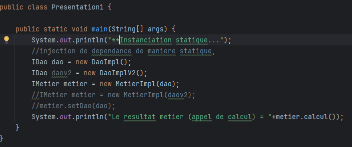
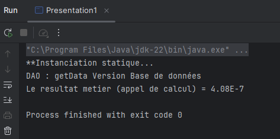
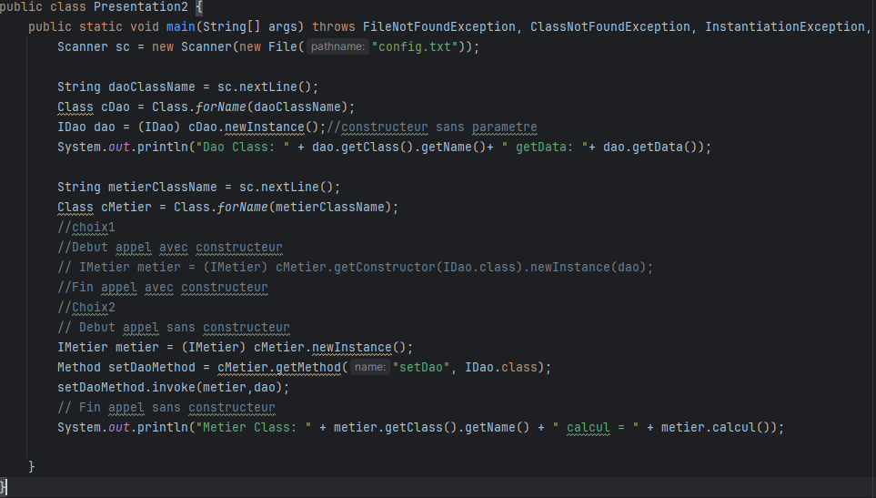
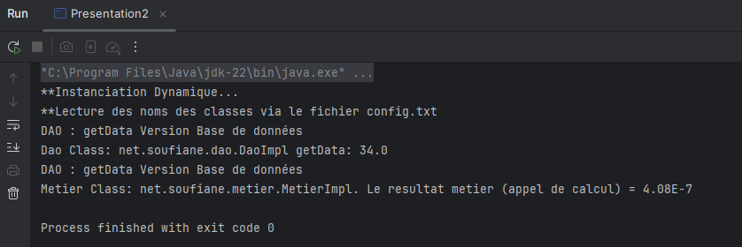
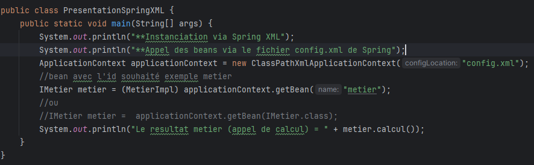
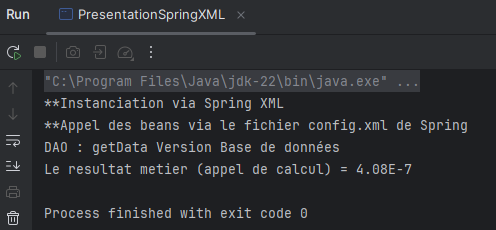
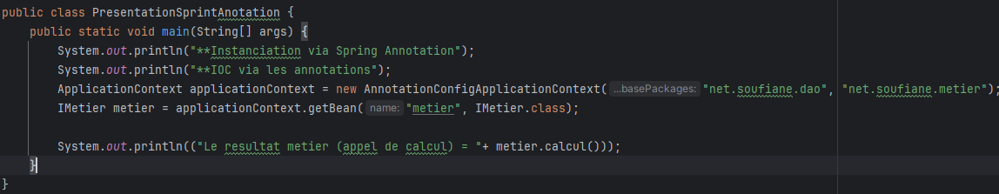
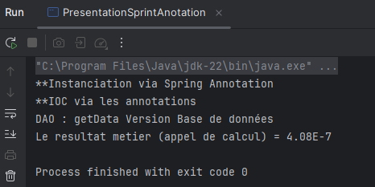

<h2>Exemple de Spring IOC</h2>
<table>
    <h3>Appel de la méthode (metier.calcul) via une instanciation statique</h3>
    <tr>
        <tr>
            <th>Instanciation statique</th>
            <th>Résultat</th>               
        </tr>
        <tr>
            <td></td>
            <td></td>
        </tr>
    </tr> 

</table>

<table>
    <h3>Appel de la méthode (metier.calcul) via une instanciation dynamique</h3>
    <tr>
        <tr>
            <th>Instanciation dynamique</th>
            <th>Résultat</th>               
        </tr>
        <tr>
            <td></td>
            <td></td>
        </tr>
    </tr> 

</table>

<table>
    <h3>Appel de la méthode (metier.calcul) via Spring XML</h3>
    <tr>
        <tr>
            <th>Instanciation via SpringXML</th>
            <th>Résultat</th>               
        </tr>
        <tr>
            <td></td>
            <td></td>
        </tr>
    </tr> 

</table>

<table>
    <h3>Appel de la méthode (metier.calcul) via Spring Annotation</h3>
    <tr>
        <tr>
            <th>Instanciation via SpringXML</th>
            <th>Résultat</th>               
        </tr>
        <tr>
            <td></td>
            <td></td>
        </tr>
    </tr> 

</table>